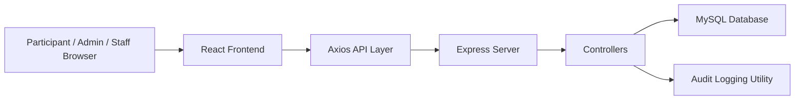
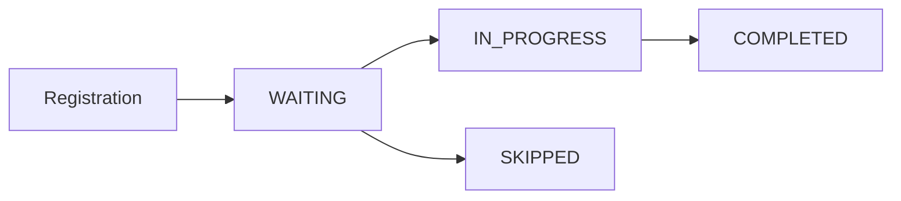

# QueueFlow Technical Report

## Project Title
QueueFlow: A Multi-Event Queue Management and Token Processing Platform

## Abstract
QueueFlow is a full-stack queue management system designed to support public-facing registration and live counter-based token processing for events such as admissions, campus help desks, document verification drives, and service workflows. The project uses a React frontend, an Express.js backend, and a MySQL database to coordinate three major actor groups: participants, admins, and counter staff. The platform allows an admin to create and manage events, define service counters, assign staff, register participants, generate queue tokens, process live tokens, and monitor operational analytics. The application also exposes a participant-facing queue board and QR-enabled registration entry point so that users can join the queue from a browser or mobile device.

This report documents the current implementation of QueueFlow based on the codebase in the repository. It covers system goals, architecture, modules, data design, API structure, frontend flows, backend controllers, queue logic, deployment assumptions, current engineering risks, and future scope. It also reflects important implementation realities, including partial security hardening, lack of automated tests, and some legacy components that coexist with the newer interface.

## 1. Introduction
QueueFlow addresses a common operational problem: when many users need to be served by multiple counters during a limited event window, manual queue handling becomes slow, unfair, and difficult to monitor. Traditional first-come-first-served systems often fail when multiple services, counters, or staff members are involved. They also provide poor visibility to participants waiting in line and limited analytics to event administrators.

The QueueFlow platform solves this by digitizing the complete queue lifecycle:

- event creation and selection
- participant registration
- token generation
- counter assignment
- live queue display
- token servicing by staff
- analytics and audit logging

The project is implemented as a web platform with a shared frontend and REST-style backend API. Its design suggests an academic admissions use case, but the code has already been generalized to support broader event-hosting scenarios.

## 2. Problem Statement
Large registration-driven events need a system that can:

- register users quickly
- distribute them across counters
- generate unique tokens
- show who is being served in real time
- allow staff to process assigned queues
- let administrators monitor operations across the event

Manual processes cause several issues:

- long waiting time
- uneven counter loads
- poor participant communication
- lack of service traceability
- no reliable activity logs
- no analytics for post-event review

QueueFlow attempts to solve these issues through a centralized queue engine and a browser-based management interface.

## 3. Objectives
The implemented system supports the following objectives:

- provide a public registration interface for participants
- generate unique queue tokens linked to an event
- automatically or manually assign users to counters
- allow an admin to create and manage multiple events
- isolate event data by admin ownership
- allow staff to log in and control their assigned counter queue
- display current and upcoming tokens on public screens
- compute basic operational analytics such as completed counts and average wait time
- store audit logs for important actions
- support export-oriented workflows from the admin dashboard

## 4. Technology Stack
QueueFlow is split into two main applications.

### Frontend
- React 19
- React Router 7
- Axios
- `qrcode.react`
- `html2canvas`
- `jspdf`
- Create React App tooling

### Backend
- Node.js
- Express 5
- MySQL 8 compatible SQL usage
- `mysql2`
- `bcryptjs`
- `cors`
- `dotenv`

### Database
- MySQL relational schema
- seeded initial data for departments, services, admin, event, and counters

## 5. High-Level Architecture
QueueFlow follows a classic three-tier architecture.

### Architectural interpretation
- The frontend is responsible for user interaction, state management, navigation, and visual reporting.
- The backend exposes REST endpoints for registration, events, counters, staff, queue operations, analytics, logs, and authentication.
- The database stores all persistent business entities.
- Audit logging is handled inside backend utility code and is called by controller actions.

This structure keeps presentation, application logic, and persistence concerns separated, although the current backend still contains some business rules directly inside controller files instead of a separate service layer.

## 6. Repository Structure
The codebase is organized into `frontend/`, `backend/`, and `docs/`.

### Important backend files
- `backend/server.js`: Express bootstrap and route mounting
- `backend/config/db.js`: MySQL connection setup
- `backend/database/schema.sql`: schema definition and seed data
- `backend/controllers/*.js`: business logic handlers
- `backend/routes/*.js`: API endpoint mapping
- `backend/utils/audit.js`: audit log insertion helper
- `backend/utils/ensureDatabase.js`: startup migration-style adjustments

### Important frontend files
- `frontend/src/App.js`: router entry point
- `frontend/src/services/api.js`: Axios base client
- `frontend/src/pages/HomeScreen.js`: public landing page and event selector
- `frontend/src/pages/EventsScreen.js`: event chooser
- `frontend/src/pages/RegisterScreen.js`: participant registration flow
- `frontend/src/pages/StudentsScreen.js`: queue board
- `frontend/src/pages/AdminHostPanel.js`: main admin workspace
- `frontend/src/pages/StaffLogin.js`: staff authentication screen
- `frontend/src/pages/StaffPanel.js`: counter-specific queue control
- `frontend/src/context/ToastContext.js`: transient UI notifications

The repository also contains some older or transitional UI components such as `AdminDashboard.js`, `AdminScreen.js`, `Students.js`, and `GenerateToken.js`, which appear to reflect earlier stages of the product.

## 7. Functional Modules

### 7.1 Event Management
Admins can create events with:

- event name
- event type
- start date
- end date
- admin ownership

The backend determines event status through `resolveStatus()` in `eventController.js`. Status becomes:

- `UPCOMING` if current time is before start
- `ENDED` if current time is after end
- `LIVE` otherwise

The frontend lets users select an event and stores the chosen `event_id` in `localStorage`. This selected event drives registration, queue viewing, analytics, and counter operations.

### 7.2 Participant Registration
Participants use the registration form to submit:

- full name
- ID or roll number
- email
- department
- phone
- category
- optional custom department name
- optional preferred counter

The backend validates the request, inserts a record into `registrations`, generates a token, links it to the relevant event and counter, and returns the token number with queue position and estimated wait.

### 7.3 Token and Queue Management
The queue engine tracks each participant through `queue_tokens`. Supported lifecycle states are:

- `WAITING`
- `IN_PROGRESS`
- `COMPLETED`
- `SKIPPED`
- `EXPIRED`

The current frontend actively uses the first four states. Tokens can be started, completed, or skipped from admin and staff interfaces.

### 7.4 Counter Management
Admins can create counters under a selected event. Each counter has:

- a counter name
- service association
- event association
- service type label

Counters are ordered using SQL window functions to generate `counter_no`, which becomes the human-facing counter sequence.

### 7.5 Staff Assignment and Counter Operation
Admins can assign staff to counters. Staff members log in using email and password, then see only the queue entries mapped to their own counter. This is a strong product feature because it narrows operational focus and reduces accidental interference across counters.

### 7.6 Public Queue Display
The queue board shows:

- participant name
- token number
- assigned counter
- status
- estimated wait

The home page also displays now-serving and upcoming tokens per counter for the selected event.

### 7.7 Analytics and Logging
The analytics endpoint currently reports:

- total registered participants
- total completed tokens
- average wait time
- service distribution

The audit log records system actions such as:

- admin registration
- admin login
- event creation
- counter creation
- staff assignment
- token start
- token completion
- token skip
- registration-generated token creation

## 8. Database Design
QueueFlow uses a relational schema with explicit foreign keys. This is appropriate for queue systems because relationships between events, registrations, counters, staff, and tokens are strongly structured.

### Core tables

#### `admins`
Stores admin identity and role data.

Key fields:
- `admin_id`
- `username`
- `contact`
- `password_hash`
- `role`
- `created_at`

#### `events`
Stores hosted event metadata.

Key fields:
- `event_id`
- `event_name`
- `event_type`
- `start_date`
- `end_date`
- `status`
- `ended_at`
- `admin_id`

#### `departments`
Stores selectable department names for registration.

#### `registrations`
Stores participant details before queue servicing.

Key fields:
- `registration_id`
- `student_name`
- `roll_number`
- `email`
- `department_id`
- `department_name`
- `category`
- `phone`
- `event_id`

#### `services`
Defines service categories and token prefixes.

Examples from seed data:
- `DOCUMENT_VERIFICATION` with prefix `N`
- `PWD_ASSISTANCE` with prefix `P`
- `LOAN_ASSISTANCE` with prefix `L`

#### `counters`
Represents physical or logical service counters.

#### `staff`
Represents operator accounts assigned to counters.

#### `queue_tokens`
This is the core operational table.

Key fields:
- `token_id`
- `token_number`
- `registration_id`
- `event_id`
- `service_id`
- `counter_id`
- `priority_level`
- `status`
- `token_time`
- `called_time`
- `completed_time`

#### `audit_logs`
Stores traceable actions across tokens, admins, and events.

### Database strengths
- foreign key references improve structural integrity
- queue state timestamps support analytics
- service prefixes enable readable token IDs
- counter association supports localized queue views

### Database limitations
- passwords for staff are stored in plaintext
- one default admin seed uses plaintext `admin123`
- no transaction wrapping exists for multi-step queue writes
- no indexes are explicitly defined for high-frequency lookups beyond implicit primary and unique keys

## 9. Backend Design

### 9.1 Server Bootstrap
`backend/server.js` loads environment variables, enables CORS and JSON parsing, mounts route groups, ensures database compatibility changes through `ensureDatabase()`, and starts the Express server.

Mounted route groups:

- `/api/token`
- `/api/queue`
- `/api/events`
- `/api/staff`
- `/api/analytics`
- `/api/register`
- `/api/auth`
- `/api/counters`
- `/api/logs`

### 9.2 Database Connectivity
`backend/config/db.js` creates a single MySQL connection using environment variables with fallback defaults. The connection is then reused throughout the application via `db.promise()`.

### 9.3 Database Compatibility Layer
`ensureDatabase.js` performs startup-time schema patching. It alters columns and conditionally adds fields if they are missing. This is effectively a lightweight migration layer. It also seeds the default admin if absent.

This is useful for rapid development, but in production it should be replaced by versioned migrations.

### 9.4 Controllers

#### Event Controller
Responsible for:
- fetching events
- filtering events by admin
- creating events
- deleting events and related child records

The delete flow cascades manually by deleting logs, tokens, registrations, staff, counters, and then the event. Because this happens through separate queries without a transaction, partial delete risk exists if a later step fails.

#### Registration Controller
This controller contains important queue logic:

- validates participant submission
- optionally auto-selects the least loaded counter
- optionally uses a requested counter
- normalizes category
- generates a token number using service prefix and last token sequence
- inserts registration and queue token rows
- computes queue position and estimated wait

The `chooseCounter()` strategy balances load by selecting the counter with the lowest count of `WAITING` and `IN_PROGRESS` tokens.

#### Queue Controller
Responsible for:
- retrieving next waiting token for a service
- starting a token
- completing a token
- skipping a token
- retrieving now-serving data
- listing all tokens for an event

Notably, `startToken()` ensures only one token can be `IN_PROGRESS` per counter at a time.

#### Staff Controller
Responsible for:
- staff creation
- login
- fetch by event or by staff ID
- delete staff member

#### Auth Controller
Responsible for admin registration and login. Admin passwords are hashed during registration using `bcryptjs`. During login, the system supports both hashed passwords and legacy plaintext values, which improves backward compatibility but weakens security posture.

#### Analytics Controller
Responsible for aggregate event metrics:
- total registration count
- completed token count
- average wait time
- service distribution

### 9.5 Logging Utility
`logAction()` writes entries into `audit_logs`. Controllers call it after successful operations. This provides an event history trail for governance and debugging.

## 10. Frontend Design

### 10.1 Routing
The frontend routes are defined in `frontend/src/App.js`:

- `/` home
- `/events`
- `/register`
- `/students`
- `/admin`
- `/staff-login`
- `/staff`
- `/help`

The app uses a persistent shell layout with `SidebarShell`.

### 10.2 Shared API Client
`frontend/src/services/api.js` configures Axios with a base URL from `REACT_APP_API_URL` or defaults to `http://localhost:5000/api`.

### 10.3 Home Screen
`HomeScreen.js` functions as:

- landing page
- event selector
- live banner
- QR registration generator
- live now-serving preview
- basic instructions page

It loads events from the backend and, when an event is selected, loads counter queue state from `/queue/now-serving`.

### 10.4 Events Screen
`EventsScreen.js` lists hosted events and lets the user choose which event becomes active on the frontend. The selected `event_id` is stored in browser storage.

### 10.5 Register Screen
`RegisterScreen.js` is the participant entry form. It is event-aware and supports both department selection and optional manual counter selection. On success, it displays the generated token and emits a toast notification.

### 10.6 Students Screen
`StudentsScreen.js` is the participant-facing queue board. It supports:

- search
- sorting
- queue statistics
- color-coded tags
- wait time visibility

This improves transparency and reduces uncertainty for waiting users.

### 10.7 Admin Host Panel
`AdminHostPanel.js` is the most operationally important frontend screen. It includes:

- admin login and registration
- event creation
- event selection
- counter creation
- staff assignment and deletion
- analytics view
- token and queue visibility
- audit log visibility

It uses `Promise.all()` to load counters, staff, tokens, analytics, and logs for the selected event, which improves responsiveness.

### 10.8 Staff Login and Staff Panel
Staff authenticate through `StaffLogin.js`, then use `StaffPanel.js` to see only their assigned counter queue. Tokens can be started, completed, or skipped directly from that screen.

### 10.9 Toast Notifications
`ToastContext.js` provides a lightweight notification system for success and failure messages across the frontend.

## 11. API Summary
The backend exposes the following main endpoint groups.

### Authentication
- `POST /api/auth/register`
- `POST /api/auth/login`
- `GET /api/auth/admins/:adminId/events`

### Events
- `GET /api/events`
- `POST /api/events`
- `DELETE /api/events/:eventId`

### Registration
- `GET /api/register/departments`
- `POST /api/register`

### Counters
- `GET /api/counters`
- `POST /api/counters`

### Staff
- `GET /api/staff`
- `POST /api/staff`
- `POST /api/staff/login`
- `DELETE /api/staff/:staffId`

### Queue
- `GET /api/queue/next`
- `POST /api/queue/start`
- `POST /api/queue/complete`
- `POST /api/queue/skip`
- `GET /api/queue/now-serving`
- `GET /api/queue/all-tokens`

### Token
- `POST /api/token/generate`

### Analytics and Logs
- `GET /api/analytics`
- `GET /api/logs`

## 12. Queue Allocation and Processing Logic
QueueFlow’s most important implementation detail is how it assigns and processes participants.

### Registration-time allocation
If a user does not manually choose a counter, the backend selects the least loaded counter for the event by counting active tokens (`WAITING` and `IN_PROGRESS`) and choosing the smallest queue.

### Token number generation
Token numbers are generated per service, not globally. The process is:

1. fetch service prefix
2. fetch latest token for that service
3. increment numeric sequence
4. format as `PREFIX-XXX`

Examples:
- `N-001`
- `P-004`
- `L-021`

### Token state flow
The operational state machine is:

`EXPIRED` exists in the schema but is not yet used in the implemented controller logic.

### Queue position and estimated wait
Queue position is computed through SQL counting on waiting tokens up to the current token at the same counter. Estimated wait is currently simplified to:

- `position * 3 minutes`

This is practical for early-stage deployments but should later be based on empirical service times.

## 13. Security and Access Control Assessment
QueueFlow includes some security-oriented elements, but the current implementation is incomplete.

### Existing strengths
- admin registration hashes passwords using bcrypt
- backend validates required fields for several operations
- admin-specific event retrieval reduces accidental cross-visibility
- staff dashboards filter queue rows to their assigned counter

### Current weaknesses
- `jsonwebtoken` is installed but not used
- `authMiddleware.js` and `roleMiddleware.js` are empty
- admin login still accepts legacy plaintext passwords
- staff passwords are stored and matched in plaintext
- the repository includes `backend/.env`, which should not be committed
- no request authentication protects event, counter, queue, or log endpoints
- authorization is enforced mostly through frontend behavior and ad hoc parameters

### Recommended improvements
- add JWT-based session authentication
- hash staff passwords using bcrypt
- implement real auth and role middleware
- move secrets out of version control
- enforce ownership checks on all protected routes
- add rate limiting and input sanitation

## 14. Reliability, Performance, and Scalability

### Positive design decisions
- load balancing across counters reduces queue skew
- server-side analytics avoid heavy client computation
- SQL window functions help create human-readable counter numbering
- route separation keeps modules manageable

### Current scalability constraints
- single MySQL connection instead of a pool
- no caching on repeated high-read endpoints
- multiple sequential queries in `nowServing()` per counter
- no transaction management for multi-step writes
- no pagination for large queue or log datasets

### Future optimization paths
- use MySQL connection pooling
- batch now-serving queries
- introduce indexed query paths for token lookup
- paginate logs and token lists
- precompute or cache queue metrics for large events

## 15. Testing Status
The project currently has no real automated test suite.

Observed evidence:
- frontend dependencies include React Testing Library packages
- backend `package.json` test script is only a placeholder
- no meaningful backend unit or integration tests are present
- no end-to-end test framework is configured

This means system behavior is currently dependent on manual verification.

### Recommended testing roadmap
- unit tests for token generation and counter selection
- integration tests for registration and queue lifecycle
- API tests for event isolation and staff access rules
- frontend tests for registration, event selection, and admin workflows
- end-to-end tests for full participant-to-service scenarios

## 16. Current Engineering Gaps
A strong technical report should reflect the real system, including unfinished areas. Based on the codebase, the main gaps are:

- security hardening is incomplete
- middleware files are empty
- backend authorization is not fully enforced
- legacy frontend files coexist with current screens
- event deletion is not transaction-safe
- no automated tests protect regressions
- default credentials and plaintext compatibility remain in the system
- PDF export is present in older screens and partial workflows, but not as a complete report pipeline

These are not reasons the project fails. They are the normal next engineering steps for taking a functional prototype toward production readiness.

## 17. Future Scope
QueueFlow has strong room for extension. Potential future improvements include:

- QR-based check-in at counters
- SMS or email token notifications
- automatic event activation and expiration jobs
- dashboard charts for wait trends and counter efficiency
- role-based access for super admin, event host, and staff
- offline-safe kiosk registration mode
- multilingual participant interface
- token recall, requeue, and expiry workflows
- CSV and PDF export for full event reports
- deployment with Docker and CI/CD pipelines

## 18. Conclusion
QueueFlow is a meaningful full-stack queue management application with real operational depth. It already supports the essential lifecycle of event-based service delivery: an admin hosts an event, participants register, tokens are assigned to counters, staff process queues, and the system provides visibility through analytics and queue displays. Its architecture is understandable, modular, and suitable for academic demonstration, capstone presentation, or continued product development.

The strongest parts of the current implementation are the event-based structure, counter-aware queue handling, role-oriented UI separation, audit logging, and participant transparency through the queue board and QR-enabled registration. The areas that most need improvement before production deployment are security, testing, data protection, and reliability safeguards such as transactions and middleware enforcement.

Overall, QueueFlow demonstrates a solid applied software engineering effort: it models a real-world process, translates it into a complete data-driven workflow, and provides enough architectural structure to support future growth.

## 19. Appendix: Key Source References

### Backend
- `backend/server.js`
- `backend/database/schema.sql`
- `backend/config/db.js`
- `backend/controllers/eventController.js`
- `backend/controllers/registrationController.js`
- `backend/controllers/queueController.js`
- `backend/controllers/staffController.js`
- `backend/controllers/authController.js`
- `backend/controllers/analyticsController.js`
- `backend/utils/audit.js`
- `backend/utils/ensureDatabase.js`

### Frontend
- `frontend/src/App.js`
- `frontend/src/services/api.js`
- `frontend/src/pages/HomeScreen.js`
- `frontend/src/pages/EventsScreen.js`
- `frontend/src/pages/RegisterScreen.js`
- `frontend/src/pages/StudentsScreen.js`
- `frontend/src/pages/AdminHostPanel.js`
- `frontend/src/pages/StaffLogin.js`
- `frontend/src/pages/StaffPanel.js`
- `frontend/src/context/ToastContext.js`